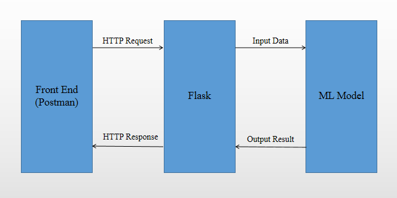

# Fraud Wall
Fraud Detector With Machine Learning

# Introduction
This project is to design a fraud detector named as Fraud Wall. During online transaction processing by Payment Switch, it needs to pass a few validations for security purpose. And Fraud Wall is part of it used to detect fraud online transactions based on transaction information. Usually Fraud Wall service can be accessed through HTTP/HTTPS call with necessary transaction information as HTTP request parameters.

# Data Source
The data set is available at Kaggle - https://www.kaggle.com/ntnu-testimon/paysim1.
Actually the dataset is a synthetic dataset generated using the simulator called PaySim. PaySim simulates mobile money transactions based on a sample of real transactions extracted from one month of financial logs from a mobile money service implemented in an African country.
In the dataset, it contains 11 columns: step, type, amount, nameOrig, oldbalanceOrg, newbalanceOrig, nameDest, oldbalanceDest, newbalanceDest, isFlaggedFraud, isFraud. Please refer detail data description available at Kaggle.

# Components

# Run Fraud Wall Service
1.

